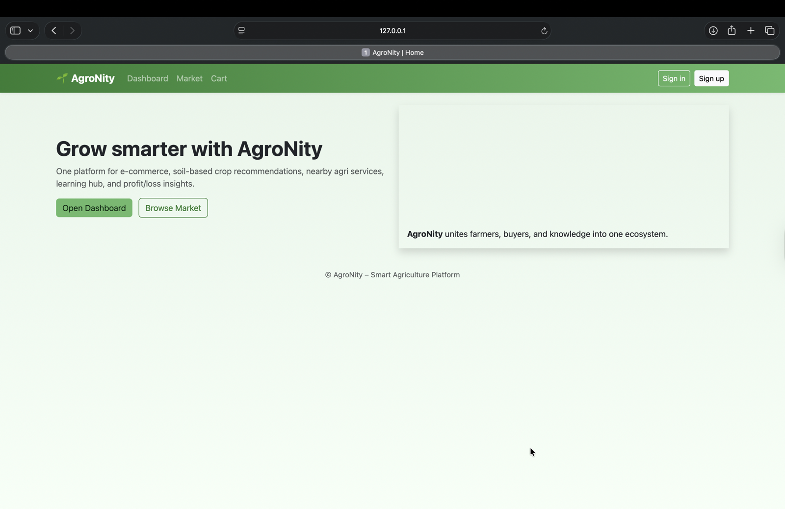

# 🌱 AgroNity — Smart Agriculture Platform

[](https://agro-nity.vercel.app)
[](https://www.python.org/)
[](https://www.djangoproject.com/)
[](https://xgboost.readthedocs.io/)
[](https://agro-nity.vercel.app)
[](https://neon.tech)

**Live site:** [https://agro-nity.vercel.app](https://agro-nity.vercel.app)

AgroNity is a **full-stack Python web application with machine learning** that unifies digital farming tools into one platform. It connects **farmers, customers, and administrators** through:

- a crop marketplace (list, edit, cart, checkout)
- an **XGBoost**-powered soil-based crop recommendation engine
- nearby agri-service maps
- a learning hub
- a profit/loss calculator

The goal is to **empower farmers with technology** — not just build another grocery app.

<p align="center">
  
</p>

---

## Table of Contents

- [About the Project](#-about-the-project)
- [Live Deployment & Performance](#-live-deployment--performance)
- [Full-Stack Python + ML Tech Stack](#-full-stack-python--ml-tech-stack)
- [Features](#-features)
- [Machine Learning Pipeline](#-machine-learning-pipeline)
- [Architecture](#-architecture)
- [Screenshots](#-screenshots)
- [Getting Started (Local)](#-getting-started-local)
- [Project Structure](#-project-structure)
- [User Roles](#-user-roles)
- [Environment Variables](#-environment-variables)
- [Roadmap](#-roadmap)
- [References & Inspiration](#-references--inspiration)

---

## 📖 About the Project

AgroNity is built as a **full-stack Python + Machine Learning** system for smart agriculture.

### What it solves
Farmers often lack one place to:
1. sell produce online
2. decide **which crop to grow** from soil and weather data
3. find nearby fertilizer shops and soil-testing centers
4. learn modern farming practices
5. estimate profit vs investment

AgroNity brings all of these into a single Django application with a trained ML model in production.

### Who it is for
| Role | What they can do |
| --- | --- |
| **Farmer** | Sign up (admin-approved), list/edit crops, use ML recommendation, maps, learning hub, profit/loss tools |
| **Customer** | Sign up (auto-approved), browse market, add to cart, checkout (demo payment) |
| **Administrator** | Approve farmers, manage users/crops/orders via Django admin |

### Key product capabilities
- Role-based authentication and approval workflow
- Marketplace with **add / edit crop** (owner-only edit)
- Shopping cart and demo checkout (USD)
- Soil-parameter crop recommendation via a pickled **XGBoost** model
- Leaflet + OpenStreetMap location search
- Learning hub with embedded tutorials
- Profit/loss calculator (margin & ROI)
- Production deployment on **Vercel** with **Neon PostgreSQL**

---

## 🚀 Live Deployment & Performance

| Metric | Value |
| --- | --- |
| **Live URL** | [https://agro-nity.vercel.app](https://agro-nity.vercel.app) |
| **Hosting** | Vercel (serverless Python / Fluid compute) |
| **Production status** | Ready (public) |
| **Typical build duration** | ~1 min 39 sec |
| **Runtime** | Python 3.12 |
| **Framework** | Django 5.2 (WSGI) |
| **Database** | Neon serverless PostgreSQL (AWS US East 2 / Ohio) |
| **Static assets** | WhiteNoise + Vercel CDN (`collectstatic` on deploy) |
| **Deploy pipeline** | GitHub `main` → Vercel auto-deploy → `build.py` (`collectstatic` + `migrate`) |
| **Auth / sessions** | PostgreSQL-backed (production-safe; not SQLite) |
| **Public visibility** | Fully public at `agro-nity.vercel.app` |

### Why this deployment stack
- **Vercel** serves the Django app as a serverless function and static files from the CDN.
- **Neon Postgres** solves Vercel’s read-only filesystem problem (SQLite cannot persist sessions/data there).
- **WhiteNoise** + Django `STATIC_ROOT` keep the green AgroNity CSS/images working in production.
- **Automatic migrations** on every deploy keep the schema in sync without manual `migrate` steps after setup.

### Local vs production
| Concern | Local | Production (Vercel) |
| --- | --- | --- |
| Database | SQLite (`db.sqlite3`) | Neon PostgreSQL via `DATABASE_URL` |
| Debug | `DEBUG=True` by default | `DJANGO_DEBUG=False` |
| Static files | Django / WhiteNoise | WhiteNoise + Vercel CDN |
| Media uploads | Local `MEDIA_ROOT` | Prefer image URLs (filesystem is ephemeral) |

---

## 🧰 Full-Stack Python + ML Tech Stack

AgroNity is intentionally built as a **Full Stack Python with Machine Learning** project. Every major layer uses Python or Python-friendly tools.

### 1) Backend (Python / Django)
| Technology | Role in AgroNity |
| --- | --- |
| **Python 3.12** | Core language for app logic, ML inference, and tooling |
| **Django 5.2** | Full-stack web framework (MVT): routing, ORM, auth, admin, templates |
| **Django custom User model** | Farmer / Customer / Admin roles + approval flags |
| **Django sessions & auth** | Secure login, logout, cart ownership |
| **Django Forms / ModelForms** | Sign up, login, add/edit crop |
| **Django Admin** | Approve users, manage crops, cart items, orders |
| **WhiteNoise** | Production static file serving (CSS, images) |
| **dj-database-url** | Parse `DATABASE_URL` for production Postgres |
| **psycopg (binary)** | PostgreSQL driver for Django |
| **Pillow** | Image handling / placeholders |

### 2) Frontend
| Technology | Role in AgroNity |
| --- | --- |
| **Django Templates** | Server-rendered UI (`base.html`, market, dashboard, auth) |
| **HTML5 / CSS3** | Structure and custom green AgroNity theme (`theme.css`) |
| **Bootstrap 5** | Responsive layout and components |
| **Leaflet.js** | Interactive maps |
| **OpenStreetMap + Nominatim** | Map tiles and place search |

### 3) Machine Learning stack (Python)
| Technology | Role in AgroNity |
| --- | --- |
| **XGBoost** | Primary crop-recommendation classifier (production model: `ml_model/xgboost.pkl`) |
| **scikit-learn** | Train/test split, metrics, alternative classifiers used during model comparison |
| **NumPy** | Feature arrays for model inference |
| **SciPy** | Scientific computing dependency of the ML stack |
| **joblib / pickle** | Serialize and load the trained model at runtime |
| **pandas** *(training / analysis)* | Dataset exploration in the companion ML notebook/repo |
| **Matplotlib / Seaborn** *(training / analysis)* | Accuracy comparison charts during model evaluation |

**ML input features:** `N`, `P`, `K`, `temperature`, `humidity`, `ph`, `rainfall`  
**ML output:** one of 22 crop labels (rice, maize, mango, coffee, …)

**Models evaluated during development** (companion soil-based crop recommendation work):

| Model | Approx. test accuracy |
| --- | :---: |
| **XGBoost** | **99.55%** |
| Gaussian Naive Bayes | 99.09% |
| Random Forest | 99.09% |
| SVM | 97.95% |
| Logistic Regression | 95.23% |
| Decision Tree | 90.00% |

### 4) Data & storage
| Technology | Role in AgroNity |
| --- | --- |
| **SQLite** | Fast local development database |
| **Neon PostgreSQL** | Production database (users, crops, carts, sessions, orders) |
| **Django ORM** | Database-agnostic models and migrations |

### 5) DevOps / deployment
| Technology | Role in AgroNity |
| --- | --- |
| **Git + GitHub** | Source control (`akhilabodepudi/AgroNity`) |
| **Vercel** | CI/CD + serverless hosting |
| **vercel.json + build.py** | Function config + deploy-time `collectstatic` / `migrate` |
| **Environment variables** | Secrets (`DJANGO_SECRET_KEY`, `DATABASE_URL`, etc.) |

### Full-stack summary (interview / resume style)
> **Full Stack Python with ML:** Django 5 backend, Django Templates + Bootstrap frontend, PostgreSQL (Neon) in production / SQLite locally, XGBoost + scikit-learn + NumPy/SciPy for soil-based crop recommendation, WhiteNoise + Vercel CDN for static assets, deployed as a public serverless app on Vercel.

---

## ✨ Features

| Module | Description |
| --- | --- |
| 🛒 **Marketplace** | Farmers list and **edit** their own crops (name, price, qty, quality, health, image URL). Customers browse, add to cart, and check out. Currency: **USD ($)**. |
| 🤖 **Crop Recommendation** | XGBoost model recommends the best crop from soil & weather inputs. |
| 🗺️ **Map Integration** | Nearby fertilizer shops and soil-testing centers (Leaflet + OSM). |
| 🎓 **Learning Hub** | Curated farming tutorials and guides. |
| 📊 **Profit / Loss Calculator** | Net result, profit margin, and ROI. |
| 👥 **Role-Based Accounts** | Farmer / Customer / Admin with approval workflow for farmers & admins. |
| 🔧 **Admin Panel** | Approve pending users, manage crops, carts, and orders. |

---

## 🧠 Machine Learning Pipeline

1. **Dataset:** crop recommendation dataset (~2,200 samples, 22 crops, 7 features).
2. **Training & comparison:** Decision Tree, Naive Bayes, SVM, Logistic Regression, Random Forest, XGBoost.
3. **Selected model:** XGBoost (highest accuracy) exported to `ml_model/xgboost.pkl`.
4. **Serving:** Django API/view loads the model with `joblib` and returns a crop prediction for user inputs.
5. **Companion repo:** [soil-based-crop-recommendation](https://github.com/akhilabodepudi/soil-based-crop-recommendation) (notebook + training/prediction scripts).

---

## 🏗️ Architecture

```text
Browser (Bootstrap + Leaflet UI)
        │
        ▼
Vercel (Django WSGI function + CDN static files)
        │
        ├── accounts/     → auth, roles, approval
        ├── market/       → marketplace, cart, checkout, ML API, maps, learning, P/L
        ├── ml_model/     → xgboost.pkl (inference)
        └── templates/ + static/  → green AgroNity UI
        │
        ▼
Neon PostgreSQL  ←── sessions, users, crops, cart, orders
```

---

## Copyright

Copyright © 2026 Akhila Bodepudi. All rights reserved.

This repository is provided for portfolio and demonstration purposes.  
No permission is granted to copy, modify, distribute, or commercially use the original source code without written permission.
